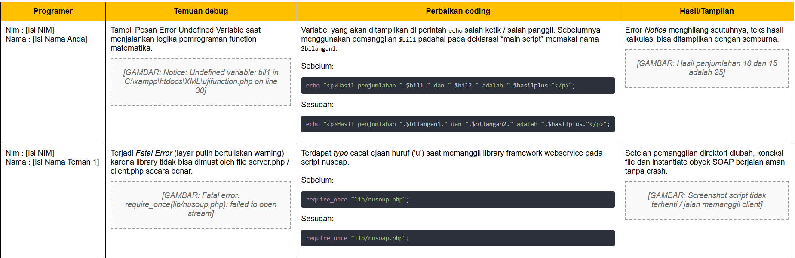
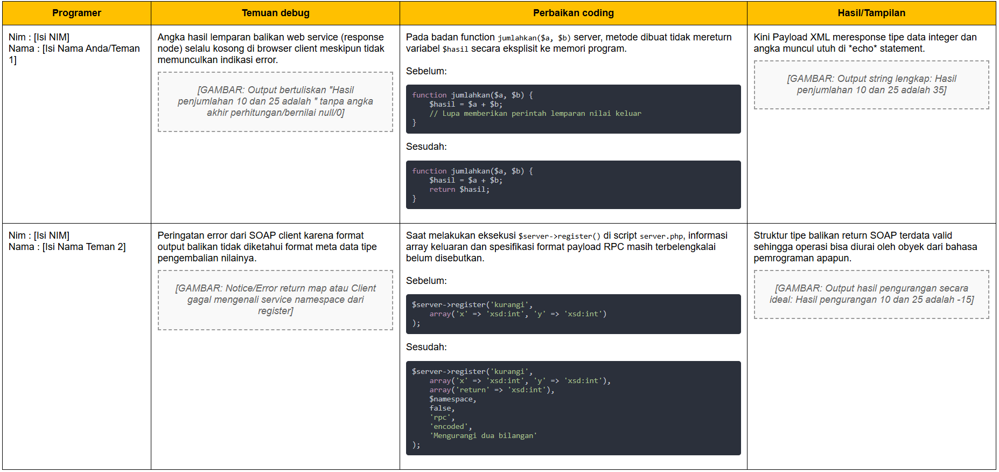

# Dokumentasi Penanganan Debug Web Service NuSOAP

Repositori ini memuat *case study* praktikum pembuatan dan perbaikan (*debugging*) layanan web service berbasis PHP menggunakan library NuSOAP, sesuai dengan modul terstruktur dan instruksi function.

Daftar error dan temuan debug selama pengerjaan dirangkum dalam tabel di bawah ini. Terdapat dua tahapan utama, yakni perbaikan PHP terstruktur dasar, dan pembenahan komunikasi arsitektur XML Client-Server NuSOAP.

## Tabel Dokumentasi Penanganan Debug

| No | Tahap / Kasus | File | Temuan Debug / Error | Perbaikan Tepat | Hasil Akhir |
|:---|:---|:---|:---|:---|:---|
| 1 | **Tahap 1 (Dasar)** Variabel *undefined* | `tugas-uji/ujifunction.php` | Terdapat pesan peringatan *Notice: Undefined variable* `$bil1` dan `$bil2` saat mencoba mengeksekusi perhitungan output matematika. | Mengganti *typo* pemanggilan pada baris perintah `echo` dari yang awalnya `$bil1` dan `$bil2`, diubah menjadi `$bilangan1` dan `$bilangan2` sesuai variabel bawaan. | Tampilan kalimat hasil perhitungan termuat sempurna dengan angka `10` dan `15`. |
| 2 | **Tahap 2 & 3 (Client)** *Fatal Error* pemanggilan library | `client.php` | Terjadi *Fatal error: require_once(lib/nusoup.php): failed to open stream* dan tampilan browser putih secara mendadak saat dijalankan. | Memperbaiki salah eja (typo) pada pemuatan file inti framework. Baris `require_once "lib/nusoup.php";` diganti menjadi *nusoap.php*. | Client berjalan normal, tidak lagi terhenti (crash), dan mendeteksi kelas SoapClient. |
| 3 | **Tahap 2 & 3 (Server)** Data lemparan hilang/kosong | `server.php` | Client terkoneksi ke WSDL server tetapi teks *return* hasil operasi `jumlahkan()` gagal dicetak (layar angka menjadi blank). | Menambahkan baris penutup `return $hasil;` yang terlupakan ke dalam kurung kurawal konstruksi *function jumlahkan($a, $b)*. | Angka `35` dari hasil matematika di server langsung terbaca lewat komunikasi RPC. |
| 4 | **Tahap 2 & 3 (Server)** Pemetaan WSDL tidak valid | `server.php` | Layanan *kurangi* memunculkan *Soap Fault* / Gagal diparsing dan dibaca response returnnya secara akurat oleh client. | Parameter `$client->register('kurangi'...` dilengkapi dengan definisi data array return `xsd:int`, namespace lokal, serta parameter RPC/Encoded. | Format balik terbaca presisi dan hasil aritmatika muncul menjadi `-15`. |

---

## Catatan Posisi Skrip
- Skrip NuSOAP dengan format yang belum dibenarkan (*buggy*) disimpan dalam folder `/before/`
- Skrip Web Service dengan logic yang disempurnakan berada pada *root* yakni `server.php` dan `client.php`
- Skrip praktikum pengasahan logika tahap dasar (Tahap 1) disimpan pada folder terpisah: `tugas-uji/after/` dan `tugas-uji/before/`

---

## Lampiran / Referensi Tabel Penanganan (Contoh Screenshot)
Berikut adalah salinan screenshot tabel dokumen referensi penanganan awal:

